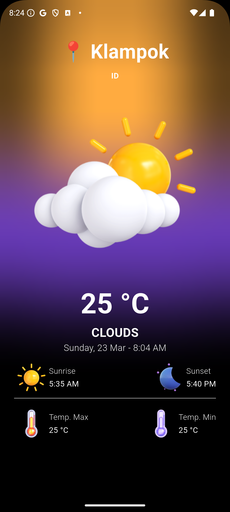

# README: Weather App with Flutter & BLoC 🌦️

## 🌟 Overview
This project is a weather application built using **Flutter** and **BLoC** for state management. The app automatically detects the user's location, fetches real-time weather data from the **OpenWeather API**, and displays it in a clean, user-friendly interface. The goal of this project is to create a scalable and maintainable app while exploring the power of BLoC for state management.

---

## 🌍 How It Works
1. **Automatic Location Detection**: The app uses the `geolocator` package to fetch the user's current location.
2. **Fetch Weather Data**: The app retrieves real-time weather data from the **OpenWeather API**.
3. **State Management with BLoC**: The app uses the `flutter_bloc` package to manage state and update the UI efficiently.
4. **Beautiful UI**: The app features a minimalist and informative design to ensure users can easily understand the weather information.

---

## 🔧 Tech Stack & Packages
- **State Management**: `flutter_bloc: ^9.1.0`
- **Date & Time Formatting**: `intl: ^0.20.2`
- **Object Comparison**: `equatable: ^2.0.7`
- **Location Detection**: `geolocator: ^13.0.2`
- **Weather Data**: `weather: ^3.1.1`
- **BLoC Support**: `bloc: ^9.0.0`
- **Environment Management**: `flutter_dotenv: ^5.2.1`

---

## 🎨 Features
- **Real-Time Weather Data**: Fetches and displays current weather conditions.
- **User-Friendly UI**: Minimalist and intuitive design.
- **Scalable Architecture**: Uses BLoC for clean and maintainable state management.
- **Secure API Key Management**: Uses `flutter_dotenv` to securely manage API keys.

---

## 🚀 Next Steps
- **Clothing Recommendations**: Add a feature to suggest clothing based on the current weather.
- **Animations**: Enhance the user experience with smooth animations.
- **Multi-Language Support**: Add support for multiple languages.

---

## 📂 Project Structure
```
lib/
├── bloc/
│   ├── weather_bloc.dart
│   ├── weather_event.dart
│   └── weather_state.dart
├── screens/
│   └── home_screen.dart
├── services/
│   └── weather_service.dart
└── main.dart
```

---

## 📝 How to Run
1. Clone the repository:
   ```bash
   git clone https://github.com/yourusername/weather-app-flutter.git
   ```
2. Navigate to the project directory:
   ```bash
   cd weather-app-flutter
   ```
3. Install dependencies:
   ```bash
   flutter pub get
   ```
4. Add your OpenWeather API key to a `.env` file:
   ```
   OPENWEATHER_API_KEY=your_api_key_here
   ```
5. Run the app:
   ```bash
   flutter run
   ```

---

## 💡 Lessons Learned
- **State Management**: BLoC is a powerful tool for managing state in Flutter apps. While it has a learning curve, it provides a clean and scalable architecture.
- **API Integration**: Learned how to securely integrate and manage API keys using `flutter_dotenv`.
- **UI Design**: Focused on creating a minimalist and user-friendly interface to enhance the user experience.

---

## 🤝 Contributions
Feel free to contribute to this project! Open an issue or submit a pull request if you have any suggestions or improvements.

---

## 📌 Hashtags
#Flutter #Dart #StateManagement #BLoC #OpenWeather #MobileDevelopment #SoftwareEngineering #FlutterDev #TechLearning #100DaysOfCode #FlutterIndonesia #IndieDev

---

# README: Aplikasi Cuaca dengan Flutter & BLoC 🌦️

## 🌟 Gambaran Umum
Proyek ini adalah aplikasi cuaca yang dibangun menggunakan **Flutter** dan **BLoC** untuk manajemen state. Aplikasi ini secara otomatis mendeteksi lokasi pengguna, mengambil data cuaca real-time dari **API OpenWeather**, dan menampilkannya dalam antarmuka yang bersih dan mudah digunakan. Tujuan proyek ini adalah membuat aplikasi yang scalable dan mudah dikelola sambil mempelajari kekuatan BLoC untuk manajemen state.

---

## 🌍 Cara Kerja
1. **Deteksi Lokasi Otomatis**: Aplikasi menggunakan package `geolocator` untuk mengambil lokasi pengguna.
2. **Ambil Data Cuaca**: Aplikasi mengambil data cuaca real-time dari **API OpenWeather**.
3. **Manajemen State dengan BLoC**: Aplikasi menggunakan package `flutter_bloc` untuk mengelola state dan memperbarui UI dengan efisien.
4. **UI yang Menarik**: Aplikasi memiliki desain minimalis dan informatif agar pengguna dapat dengan mudah memahami informasi cuaca.

---

## 🔧 Teknologi & Package yang Digunakan
- **Manajemen State**: `flutter_bloc: ^9.1.0`
- **Format Tanggal & Waktu**: `intl: ^0.20.2`
- **Perbandingan Objek**: `equatable: ^2.0.7`
- **Deteksi Lokasi**: `geolocator: ^13.0.2`
- **Data Cuaca**: `weather: ^3.1.1`
- **Dukungan BLoC**: `bloc: ^9.0.0`
- **Manajemen Environment**: `flutter_dotenv: ^5.2.1`

---

## 🎨 Fitur
- **Data Cuaca Real-Time**: Menampilkan kondisi cuaca saat ini.
- **UI yang Mudah Digunakan**: Desain minimalis dan intuitif.
- **Arsitektur Scalable**: Menggunakan BLoC untuk manajemen state yang bersih dan mudah dikelola.
- **Manajemen API Key yang Aman**: Menggunakan `flutter_dotenv` untuk mengelola API key dengan aman.

---

## 🚀 Langkah Selanjutnya
- **Rekomendasi Pakaian**: Menambahkan fitur untuk menyarankan pakaian berdasarkan cuaca saat ini.
- **Animasi**: Meningkatkan pengalaman pengguna dengan animasi yang halus.
- **Dukungan Multi-Bahasa**: Menambahkan dukungan untuk beberapa bahasa.

---

## 📂 Struktur Proyek
```
lib/
├── bloc/
│   ├── weather_bloc.dart
│   ├── weather_event.dart
│   └── weather_state.dart
├── screens/
│   └── home_screen.dart
├── services/
│   └── weather_service.dart
└── main.dart
```

---

## 📝 Cara Menjalankan
1. Clone repository:
   ```bash
   git clone https://github.com/yourusername/weather-app-flutter.git
   ```
2. Masuk ke direktori proyek:
   ```bash
   cd weather-app-flutter
   ```
3. Install dependencies:
   ```bash
   flutter pub get
   ```
4. Tambahkan API key OpenWeather ke file `.env`:
   ```
   OPENWEATHER_API_KEY=your_api_key_here
   ```
5. Jalankan aplikasi:
   ```bash
   flutter run
   ```

---

## 💡 Pelajaran yang Didapat
- **Manajemen State**: BLoC adalah alat yang powerful untuk mengelola state di aplikasi Flutter. Meskipun memiliki kurva belajar, BLoC menyediakan arsitektur yang bersih dan scalable.
- **Integrasi API**: Belajar cara mengintegrasikan dan mengelola API key dengan aman menggunakan `flutter_dotenv`.
- **Desain UI**: Fokus pada pembuatan antarmuka yang minimalis dan mudah digunakan untuk meningkatkan pengalaman pengguna.

---

## 🤝 Kontribusi
Silakan berkontribusi pada proyek ini! Buka issue atau ajukan pull request jika Anda memiliki saran atau perbaikan.

---

## 📌 Hashtag
#Flutter #Dart #StateManagement #BLoC #OpenWeather #MobileDevelopment #SoftwareEngineering #FlutterDev #TechLearning #100DaysOfCode #FlutterIndonesia #IndieDev

--- 

Screenshots :


